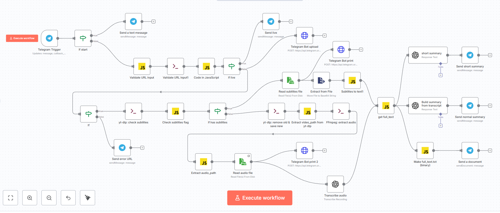

# YouTube to Text Telegram Bot (n8n)

n8n workflow for a Telegram bot that processes YouTube links and returns:

- short summary (3–4 sentences)
- structured summary (10–12 sentences)
- full transcript as a `.txt` file

This workflow is useful when you need to quickly understand what a video is about, especially if the video is long.

It is also useful for multilingual content:
- you can process videos in many common languages
- get text and summaries in your own language
- use the extracted text as context for an LLM or for further discussion with an LLM

The workflow first tries to use YouTube subtitles. If subtitles are unavailable, it downloads the video audio, transcribes it, and then generates summaries.

## How it works

1. Telegram bot receives a YouTube link.
2. The workflow validates the URL.
3. It checks whether the link is a live stream.
4. If the link points to a live stream, processing stops.
5. The workflow tries to fetch YouTube subtitles.
6. If subtitles are available, it reads the subtitle file, cleans the text, removes duplicates, and builds the final transcript.
7. If subtitles are not available, it downloads the video, extracts audio, and transcribes it.
8. Then it generates:
   - short summary (3–4 sentences)
   - structured summary (10–12 sentences)
   - full transcript as TXT
9. Finally, it sends the results back to Telegram.

## Working directory

The workflow uses a working directory variable:

```bash
YOUTUBE_WORKDIR=/data/youtube_video
```

If `YOUTUBE_WORKDIR` is not set, the default path is:

```bash
/data/youtube_video
```

This directory is used to store temporary working files, such as:
- downloaded video
- extracted audio
- subtitle files
- intermediate processing artifacts

## Requirements

- n8n
- Telegram bot
- OpenAI credentials configured in n8n
- `yt-dlp`
- `ffmpeg`

## Repository contents

- `you-tube_to_text.json` — sanitized public n8n workflow export
- `youtube-to-text.png` — workflow screenshot

## Notes

This repository contains a public-safe workflow export:
- tokens are removed
- credentials are placeholders
- internal instance identifiers are removed

Before running it in your own environment, configure:
- Telegram credentials
- OpenAI credentials
- bot token placeholder in HTTP Request nodes if needed
- working directory path

## Use cases

- Quickly understand long YouTube videos without watching them fully
- Extract transcript from videos in different languages
- Get summaries in a convenient form for review
- Use transcript text as context for LLM workflows
- Discuss video content with an LLM using the extracted transcript

## License

MIT

---

# YouTube to Text Telegram Bot (n8n)

n8n workflow для Telegram-бота, который обрабатывает YouTube-ссылки и возвращает:

- краткое саммари (3–4 предложения)
- структурированное саммари (10–12 предложений)
- полный текст в виде `.txt` файла

Этот workflow полезен, когда нужно быстро понять, о чём видео, особенно если видео длинное.

Также он удобен для работы с многоязычным контентом:
- можно обрабатывать видео почти на всех распространённых языках
- получать текст и саммари на своем языке
- использовать полученный текст как контекст для LLM или для дальнейшего обсуждения с LLM

Сначала workflow пытается использовать субтитры YouTube. Если субтитров нет, он скачивает аудио из видео, делает транскрипцию и затем формирует саммари.

## Как работает workflow

1. Telegram-бот получает ссылку на YouTube.
2. Workflow валидирует URL.
3. Проверяет, не является ли ссылка прямым эфиром.
4. Если это прямой эфир, обработка останавливается.
5. Workflow пытается получить субтитры YouTube.
6. Если субтитры доступны, он читает файл субтитров, очищает текст, удаляет повторы и формирует итоговую расшифровку.
7. Если субтитров нет, workflow скачивает видео, извлекает аудио и делает транскрипцию.
8. После этого формирует:
   - краткое саммари (3–4 предложения)
   - структурированное саммари (10–12 предложений)
   - TXT-файл с полным текстом
9. Затем отправляет результат обратно в Telegram.

## Рабочая директория

Workflow использует переменную рабочей директории:

```bash
YOUTUBE_WORKDIR=/data/youtube_video
```

Если `YOUTUBE_WORKDIR` не задана, по умолчанию используется путь:

```bash
/data/youtube_video
```

Эта директория нужна для хранения временных рабочих файлов, например:
- скачанного видео
- извлечённого аудио
- файлов субтитров
- промежуточных артефактов обработки

## Требования

- n8n
- Telegram bot
- настроенные OpenAI credentials в n8n
- `yt-dlp`
- `ffmpeg`

## Содержимое репозитория

- `you-tube_to_text.json` — очищенный публичный export workflow из n8n
- `youtube-to-text.png` — скриншот workflow

## Примечания

В этом репозитории находится публичная безопасная версия workflow:
- токены удалены
- credentials заменены заглушками
- внутренние идентификаторы инстанса удалены

Перед запуском у себя нужно настроить:
- Telegram credentials
- OpenAI credentials
- заглушку bot token в HTTP Request нодах, если это нужно
- путь рабочей директории

## Примеры применения

- Быстро понять содержание длинного YouTube-видео без полного просмотра
- Получить расшифровку видео на разных языках
- Сформировать удобное саммари для чтения
- Использовать текст видео как контекст для LLM
- Обсуждать содержание видео с LLM на основе полученной расшифровки

## Схема workflow



## Лицензия

MIT
